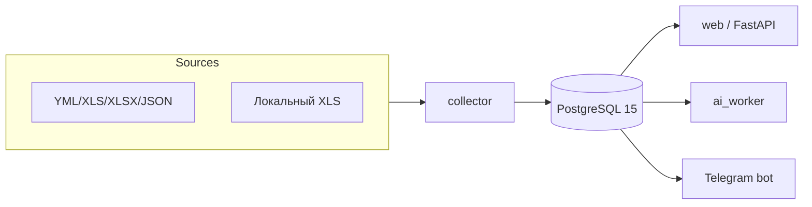

# PriceDesk — контракт для агента

**Версия:** 1.0.0 · **Вайб:** professional — аналитика, которая не кричит, а показывает цифры.

## 0. Режим работы

- **pair-programmer**, не автономный продакт. Пользователь задаёт приоритеты; агент исполняет, проверяет и сужает неопределённость.
- **Язык:** русский (продукт для РФ / B2B / ВКР). Исключение: имена переменных, комментарии к коду и открытые API-документы — English.
- **Тон:** professional — сухие термины, точные формулировки, никакого «AI-волшебства».

## 1. Продукт

PriceDesk — микросервисная система сбора и анализа цен для электротехнического B2B-сегмента.

- Собирает прайсы из десятков источников (YML, XLS, XLSX, JSON, локальные файлы).
- Нормализует офферы в `normalized_offers` и строит канонические кластеры `canonical_products`.
- Считает price intelligence: медиану, индекс цены, эвристику себестоимости, floor-маржу.
- Предлагает fuzzy-кандидатов на сопоставление, которые аналитик ревьюит вручную.
- Ищет аномалии цен, строит упрощённые прогнозы и уведомляет через Telegram-бота.

Ключевая ценность: **данные вместо интуиции**, с явной честностью про границы сопоставления.

## 2. Вайб

- **Тон:** professional — спокойная, уверенная аналитическая речь.
- **3 правила:**
  1. **Точность прежде красоты.** Каждая цифра и формулировка должны быть проверяемыми: источник, метрика, порог.
  2. **Код и команды — первый класс.** Любой блок в README копируется и работает из коробки.
  3. **Честность про границы.** Сопоставление — это exact-пересечения + fuzzy-кандидаты + ручной ревью, а не автономный entity resolution.

## 3. Стек и архитектура

| Область | Технология |
|---------|------------|
| Язык | Python 3.11+ |
| Веб / API | FastAPI, Jinja2 |
| База данных | PostgreSQL 15, SQLAlchemy 2.x, Alembic |
| ML / аналитика | scikit-learn, pandas, numpy |
| Инфраструктура | Docker, Docker Compose, nginx |
| Тесты | pytest, httpx |
| CI | GitHub Actions |

Сервисы Docker Compose: `db`, `adminer` (dev), `collector`, `web`, `ai_worker`, `bot`.

## 4. Инженерная дисциплина

- **KISS / минимальный diff / YAGNI.** Не добавляй абстракций «на вырост».
- **Не ломай:** если не уверен на 100% — спроси, не делай предположений.
- **Не коммить** `.env`, `*.pem`, `id_*`, токены, пароли, `node_modules/`, `__pycache__/`, крупные бинарники без явного согласования.
- **Типизация и документация:** новые модули — с type hints и docstrings.
- **Миграции:** любое изменение схемы — через Alembic.
- **Секреты только через env:** не хардкодь ключи API и пароли.

## 5. Git workflow

- Коммить результат задачи — часть работы.
- Пушь, если пользователь просил или задача явно требует публикации.
- **Текущая ветка:** `main`.
- **Remotes:**
  - `origin` — `git@github.com:Shugar86/ecommerce-price-analytics.git`

## 6. Definition of Done

1. Релевантные `pytest` / lint / `python -m compileall` проходят без ошибок.
2. В отчёте: что изменилось, что запускал, риски, соответствие вайбу продукта.
3. Документация (`README.md`, `AGENTS.md`, `CHANGELOG.md`, `CONTRIBUTING.md`) актуальна, если менялся контракт, запуск или архитектура.
4. Секреты не попали в индекс.

## 7. Эскалация

Спроси пользователя, если:

- есть риск засветить секреты или личные данные;
- два равных архитектурных пути и нет явного приоритета;
- задача касается prod-деплоя, CI/CD или публикации репозитория.

---

См. также: [README.md](./README.md) · [LICENSE](./LICENSE) · [CONTRIBUTING.md](./CONTRIBUTING.md) · [CHANGELOG.md](./CHANGELOG.md)
