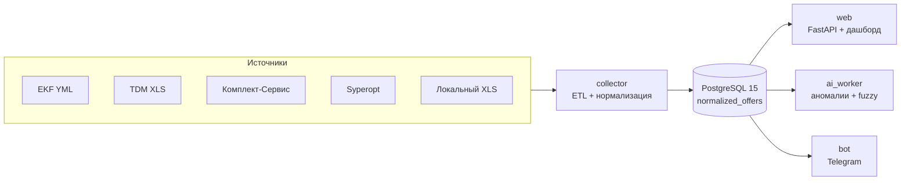

# PriceDesk — ценовая аналитика B2B-прайсов

[](./LICENSE)
[](./requirements.txt)
[](./docker-compose.yml)
[](./app/web/main.py)
[](./.github/workflows/ci.yml)

> **Аналитика, которая не кричит, а показывает цифры.**

## Что это

**PriceDesk** — микросервисное приложение для сбора, нормализации и визуального анализа цен в электротехническом B2B-сегменте. Оно объединяет прайс-листы поставщиков (EKF, TDM Electric, Комплект-Сервис, Syperopt и др.), строит единый нормализованный слой офферов, считает рыночные KPI и помогает аналитику принимать решения на основе данных, а не интуиции.

Система создана в первую очередь для **ВКР / отчёта по практике**: полная Docker-сборка, веб-дашборд, Telegram-бот, тесты и инструменты для защиты — всё работает из коробки.

## Возможности

- ⚡ **Мультиисточниковый ETL** — YML, XLS, XLSX, JSON и локальные файлы в единую БД через `docker compose up`.
- 🧹 **Нормализованный слой** — таблицы `normalized_offers` и `canonical_products` с едиными полями цен, брендов, артикулов и штрихкодов.
- 📊 **Price intelligence** — медиана рынка, индекс цены, эвристика себестоимости, floor-маржа и рекомендуемое действие.
- 🔍 **Ассистированное сопоставление** — exact-пересечения по штрихкоду / артикулу + fuzzy-кандидаты (Jaccard / TF‑IDF) с ручным ревью в веб-интерфейсе.
- 🤖 **Telegram-бот** — быстрый поиск товаров, статистика и алерты.
- 🛡️ **Аномалии и прогноз** — ML-воркер ищет скачки цен, поддельные скидки и строит упрощённый линейный прогноз.
- 🎓 **Готовность к защите** — Alembic-миграции, pytest, CI, скрипты отчётов и визуализаций.

## Быстрый старт

### 1. Клонировать и настроить окружение

```bash
git clone https://github.com/Shugar86/ecommerce-price-analytics.git
cd ecommerce-price-analytics
cp env.example .env
# отредактируйте .env: BOT_TOKEN от @BotFather, пароли БД и т.д.
```

Минимальный `.env`:

```env
POSTGRES_USER=courseuser
POSTGRES_PASSWORD=coursepass
POSTGRES_DB=prices_db
POSTGRES_HOST=db
POSTGRES_PORT=5432

BOT_TOKEN=your_token_here_from_botfather

AI_WORKER_INTERVAL_SEC=300
SEED_DEMO_HISTORY=1
```

> Полный список переменных и их смысл — в [`env.example`](./env.example) и [`docs/PRODUCT_SCOPE.md`](./docs/PRODUCT_SCOPE.md).

### 2. Запустить стек

```bash
docker compose up -d --build
```

Откройте дашборд: [http://localhost:8000](http://localhost:8000)

Для доступа к PostgreSQL и Adminer с хоста:

```bash
docker compose -f docker-compose.yml -f docker-compose.dev.yml up -d --build
# Adminer: http://localhost:8080
```

### 3. Проверить, что всё поднялось

```bash
curl -s http://localhost:8000/health
curl -s http://localhost:8000/ready
docker compose logs -f collector
```

Успешный цикл сбора подтверждается строками `ETL_SOURCE_HEALTH_SUMMARY` и `✅ Цикл сбора данных завершен`.

### 4. Telegram-бот

Найдите своего бота в Telegram и отправьте:

```text
/start
/stats
/find tdm e14 gu10
```

## Архитектура



### Стек

| Область | Технология |
|---------|------------|
| Язык | Python 3.11+ |
| Веб / API | FastAPI, Jinja2 |
| База данных | PostgreSQL 15, SQLAlchemy 2.x, Alembic |
| ML / аналитика | scikit-learn, pandas, numpy |
| Инфраструктура | Docker, Docker Compose, nginx |
| Тесты | pytest, httpx |
| CI | GitHub Actions |

### Сервисы Docker Compose

| Сервис | Назначение | Порт |
|--------|------------|------|
| `db` | PostgreSQL | — (5432 в `docker-compose.dev.yml`) |
| `adminer` | Веб-админка БД (только dev) | 8080 |
| `collector` | ETL: сбор, нормализация и загрузка прайсов | — |
| `web` | FastAPI + Jinja2 дашборд | 8000 |
| `ai_worker` | Аномалии, fuzzy-кандидаты, прогнозы | — |
| `bot` | Telegram-бот | — |

## Структура проекта

```text
.
├── app/
│   ├── collector.py            # основной ETL-цикл
│   ├── ai_worker.py            # воркер аномалий и fuzzy-сопоставления
│   ├── bot.py                  # Telegram-бот
│   ├── database.py             # модели SQLAlchemy
│   ├── analytics/              # price intelligence, KPI, canonical sync
│   ├── collectors/             # парсеры конкретных источников
│   ├── matching/               # нормализация имён и текстовые эвристики
│   ├── ml/                     # TF-IDF, Jaccard, name normalization
│   ├── quality/                # метрики полноты и exact-пересечений
│   ├── services/               # общие read-запросы
│   └── web/                    # FastAPI + шаблоны Jinja2
├── alembic/                    # миграции БД
├── tests/                      # pytest
├── tools/                      # скрипты защиты, диаграммы, отчёты
├── docs/                       # продуктовая и академическая документация
├── docker-compose.yml          # production-like запуск
├── docker-compose.dev.yml      # dev-порты db/adminer
├── env.example                 # шаблон переменных окружения
├── COMMANDS.md                 # шпаргалка по командам
├── ENV_SETUP.md                # как создать .env и получить токен
└── README_REPORT.md            # полная академическая документация
```

## Источники данных

| Источник | Формат | URL |
|----------|--------|-----|
| ЦБ РФ | XML | `http://www.cbr.ru/scripts/XML_daily.asp` |
| EKF | YML | `https://export-xml.storage.yandexcloud.net/products.yml` |
| TDM Electric | XLS | `https://tdme.ru/download/priceTDM.xls` |
| Комплект-Сервис (бренды) | XLS | `https://www.complect-service.ru/prices/ekf.xls` и др. |
| Syperopt | XLSX | `http://www.syperopt.ru/price_wago_abb_legrand_iek_495t5890043_syperopt_ru.xlsx` |
| TBM Market | YML | `https://www.tbmmarket.ru/tbmmarket/service/yandex-market.xml` |
| GalaCentre | YML | `https://www.galacentre.ru/download/yml/yml.xml` |
| FakeStore | JSON | `https://fakestoreapi.com/products` (только при `ENABLE_FAKESTORE=1`) |

Справочник штрихкодов (Tier B) — см. [`env.example`](./env.example).

## Сопоставление: честно про границы

PriceDesk **не** обещает полностью автоматическое объединение каталогов без ошибок. Она даёт:

1. **Exact-пересечения** по устойчивым ключам: `barcode`, `vendor_code`, `brand + артикул`.
2. **Fuzzy-кандидатов** по сходству наименований (Jaccard / TF‑IDF).
3. **Ручной ревью** в веб-интерфейсе: подтвердить или отклонить каждого кандидата.

Подробнее — в [`docs/PRODUCT_SCOPE.md`](./docs/PRODUCT_SCOPE.md).

## Примеры

### Проверка API

```bash
# жива ли служба?
curl -s http://localhost:8000/health
# {"status":"ok"}

# готова ли к трафику (БД доступна)?
curl -s http://localhost:8000/ready
# {"status":"ready","database":"ok"}
```

### Веб-эндпоинты после запуска

| URL | Что показывает |
|-----|----------------|
| `/` | Сводка KPI «Сегодня» |
| `/market` | Рыночная позиция и цены |
| `/sources` | Здоровье источников (`source_health`) |
| `/matches` | Очередь fuzzy-кандидатов на ревью |
| `/alerts` | Ценовые аномалии |

### Выгрузка данных

```bash
# товары в CSV
curl -s http://localhost:8000/export/products.csv > products.csv

# аномалии в CSV
curl -s http://localhost:8000/export/anomalies.csv > anomalies.csv
```

## Тесты

Локально (без Docker):

```bash
python3 -m venv .venv
source .venv/bin/activate
pip install -r requirements.txt

python -m compileall app/ tools/ tests/
pytest tests/ -q
```

## Документация

- [`docs/PRODUCT_SCOPE.md`](./docs/PRODUCT_SCOPE.md) — объём продукта и терминология.
- [`COMMANDS.md`](./COMMANDS.md) — команды для запуска, отладки и защиты.
- [`ENV_SETUP.md`](./ENV_SETUP.md) — как создать `.env` и получить токен бота.
- [`FAQ.md`](./FAQ.md) — частые вопросы.
- [`VKR_AND_PRACTICE_REPORT.md`](./VKR_AND_PRACTICE_REPORT.md) — структура ВКР и отчёта по практике.
- [`CHANGELOG.md`](./CHANGELOG.md) — история изменений.
- [`CONTRIBUTING.md`](./CONTRIBUTING.md) — как участвовать.

## Лицензия

[MIT](./LICENSE) © 2026 Shugar86.

---

**Направление:** 09.03.03 «Прикладная информатика»
