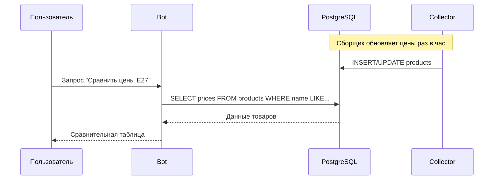
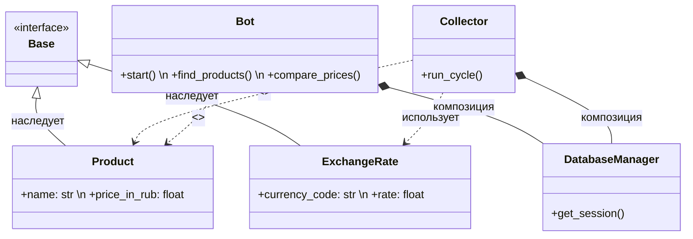
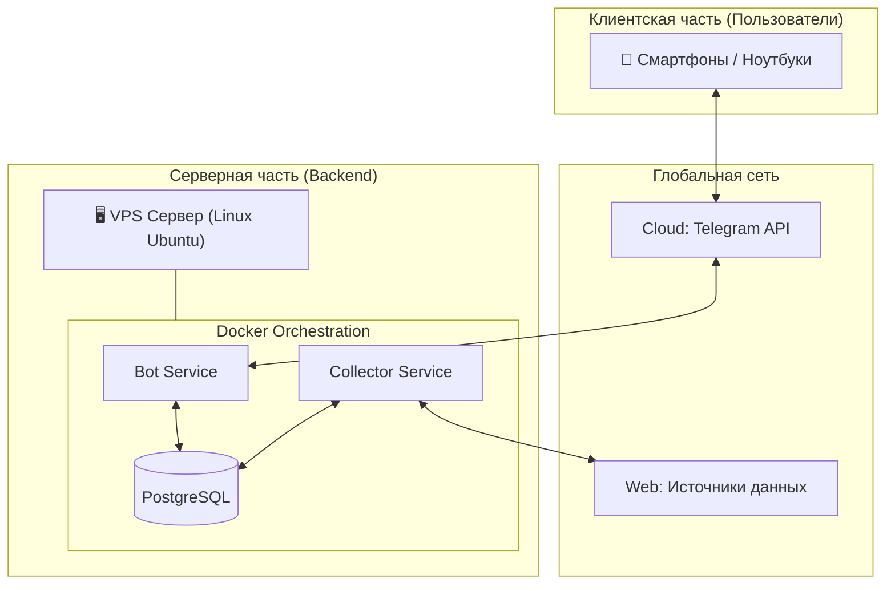
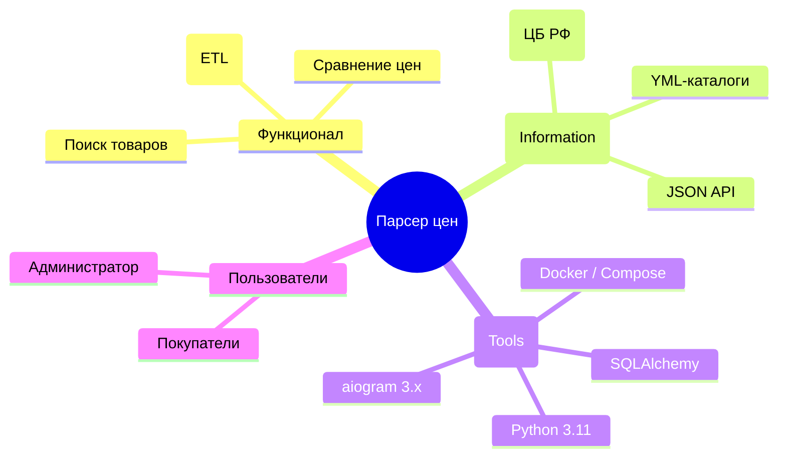

# ПОЯСНИТЕЛЬНАЯ ЗАПИСКА К КУРСОВОМУ ПРОЕКТУ

**Тема:** «Разработка распределенной системы сбора и анализа данных о ценах товаров с торговых площадок»  
**Дисциплина:** Распределенные вычисления  

---

## СОДЕРЖАНИЕ

1. [ВВЕДЕНИЕ](#введение)
2. [1. АНАЛИТИЧЕСКАЯ ЧАСТЬ](#1-аналитическая-часть)
   - 1.1. [Описание предметной области](#11-описание-предметной-области)
   - 1.2. [Обоснование применения распределенных вычислений](#12-обоснование-применения-распределенных-вычислений)
   - 1.3. [Теоретические основы современных распределенных вычислительных систем](#13-теоретические-основы-современных-распределенных-вычислительных-систем)
   - 1.4. [Концепция аппаратных и программных решений](#14-концепция-аппаратных-и-программных-решений)
3. [2. ПРАКТИЧЕСКОЕ ПРИМЕНЕНИЕ И ПРОЕКТИРОВАНИЕ](#2-практическое-применение-и-проектирование)
   - 2.1. [Анализ применяемых технологий](#21-анализ-применяемых-технологий)
   - 2.2. [Проектирование системы (Диаграммы)](#22-проектирование-системы-диаграммы)
     - 2.2.1. [Диаграмма вариантов использования — Пользователь](#221-диаграмма-вариантов-использования--пользователь)
     - 2.2.2. [Диаграмма вариантов использования — Администратор](#222-диаграмма-вариантов-использования--администратор)
     - 2.2.3. [Диаграмма последовательности](#223-диаграмма-последовательности)
     - 2.2.4. [Диаграмма деятельности](#224-диаграмма-деятельности)
     - 2.2.5. [Диаграмма классов](#225-диаграмма-классов)
     - 2.2.6. [Дополнительные диаграммы](#226-дополнительные-диаграммы)
   - 2.3. [Разработка программного приложения](#23-разработка-программного-приложения)
   - 2.4. [Описание контрольного примера](#24-описание-контрольного-примера)
4. [ЗАКЛЮЧЕНИЕ](#заключение)
5. [СПИСОК ИСПОЛЬЗОВАННЫХ ИСТОЧНИКОВ](#список-использованных-источников)

---

## ВВЕДЕНИЕ

В современной экономике оперативный мониторинг цен является залогом конкурентоспособности. Данный проект посвящен разработке распределенной системы, которая автоматически собирает данные из разнородных источников (API, YML, XLS), нормализует их и предоставляет удобный интерфейс доступа через Telegram-бота.

**Цель работы:** Проектирование и реализация отказоустойчивой распределенной архитектуры для ETL-процессов (Extract, Transform, Load) в сфере электронной коммерции.

---

## 1. АНАЛИТИЧЕСКАЯ ЧАСТЬ

### 1.1. Описание предметной области
Предметная область охватывает автоматизацию сбора данных о товарах электротехнического назначения. Основная сложность заключается в децентрализации данных: поставщики используют разные валюты (USD, EUR, RUB) и форматы передачи данных. Система должна выступать «агрегатором», приводя всё к единому стандарту.

### 1.2. Обоснование применения распределенных вычислений
Использование распределенной архитектуры обусловлено необходимостью:
1. **Изоляции задач:** Сбор данных (Collector) не должен блокировать интерфейс пользователя (Bot).
2. **Масштабируемости:** Возможность запускать несколько экземпляров сборщика для разных регионов.
3. **Отказоустойчивости:** Падение Telegram-интерфейса не останавливает процесс накопления данных в БД.

### 1.3. Теоретические основы современных распределенных вычислительных систем
Проект опирается на микросервисный подход и контейнеризацию. 
* **Микросервисы:** Система разделена на функционально независимые блоки, взаимодействующие через общую базу данных.
* **Контейнеризация (Docker):** Использование контейнеров обеспечивает идентичность среды разработки и эксплуатации (DevOps-подход), гарантируя, что система запустится на любом сервере.
* **CAP-теорема:** В нашей системе соблюдается баланс между согласованностью (Consistency) и доступности (Availability) за счет использования реляционной СУБД PostgreSQL.
* **Событийная модель:** Взаимодействие с Telegram Bot API происходит асинхронно, что характерно для современных распределенных интерфейсов.

### 1.4. Концепция аппаратных и программных решений
**Аппаратное решение:** Клиент-серверная архитектура. Пользователь взаимодействует со смартфоном, который по HTTPS обращается к облачному серверу (VPS).
**Программное решение:** Стек Python 3.11 для логики, PostgreSQL для хранения, Docker Compose для оркестрации сервисов.

---

## 2. ПРАКТИЧЕСКОЕ ПРИМЕНЕНИЕ И ПРОЕКТИРОВАНИЕ

### 2.1. Анализ применяемых технологий
* **aiogram 3.x:** Асинхронный фреймворк для взаимодействия с Telegram Bot API.
* **SQLAlchemy 2.0:** ORM для безопасной работы с БД и миграции схем.
* **lxml:** Высокопроизводительный парсер для потоковой обработки XML/YML файлов большого объема без перегрузки RAM.

### 2.2. Проектирование системы (Диаграммы)

#### 2.2.1. Диаграмма вариантов использования — Пользователь
```mermaid
usecaseDiagram
    actor "Пользователь\n(группа: клиенты Telegram)" as U
    package "Telegram Bot" {
        usecase "Найти товар" as UC1
        usecase "Сравнить цены" as UC2
        usecase "Посмотреть магазины" as UC3
        usecase "Получить статистику" as UC4
    }
    U --> UC1
    U --> UC2
    U --> UC3
    U --> UC4
```

#### 2.2.2. Диаграмма вариантов использования — Администратор
```mermaid
usecaseDiagram
    actor "Администратор\n(группа: сопровождение системы)" as A
    package "Система управления" {
        usecase "Проверить статус контейнеров" as UA1
        usecase "Запустить сбор данных" as UA2
        usecase "Просмотреть логи ошибок" as UA3
        usecase "Очистить базу данных" as UA4
    }
    A --> UA1
    A --> UA2
    A --> UA3
    A --> UA4
```

#### 2.2.3. Диаграмма последовательности


#### 2.2.4. Диаграмма деятельности
```mermaid
flowchart TD
    A[Старт цикла] --> B[Получить курсы валют ЦБ РФ]
    B --> C{Успех?}
    C -->|Да| D[Загрузить YML/XLS источники]
    C -->|Нет| E[Лог ошибки] --> D
    D --> F[Нормализация названий]
    F --> G[Конвертация цен в RUB]
    G --> H[Сохранение в БД (Upsert)]
    H --> I[Ожидание 1 час] --> A
```

#### 2.2.5. Диаграмма классов


#### 2.2.6. Дополнительные диаграммы

##### Схема аппаратного обеспечения


##### Интеллект-карта системы (Mind Map)


---

### 2.3. Разработка программного приложения

Процесс разработки системы был разделен на логические этапы, соответствующие микросервисному подходу. Ниже представлено детальное описание реализации ключевых компонентов.

#### 2.3.1. Структура проекта и распределение ответственности

Система состоит из следующих модулей:
- **`app/database.py`**: Слой доступа к данным. Описывает структуру БД и управляет подключениями.
- **`app/collector.py`**: ETL-сервис. Отвечает за извлечение данных, их трансформацию и загрузку в БД.
- **`app/bot.py`**: Сервис интерфейса. Обрабатывает запросы пользователей в Telegram.
- **`docker-compose.yml`**: Файл оркестрации, связывающий сервисы в единую распределенную сеть.

---

#### 2.3.2. Этапы реализации проекта

##### Шаг 1: Проектирование схемы данных (`database.py`)
На этом этапе была разработана объектно-реляционная модель (ORM) для хранения товаров и курсов валют. Использование SQLAlchemy позволило абстрагироваться от SQL-запросов и обеспечить типизацию данных.

**Ключевой момент:** Описание модели товара с индексами для быстрого поиска.
```python
class Product(Base):
    __tablename__ = 'products'
    
    id: Mapped[int] = mapped_column(primary_key=True, autoincrement=True)
    external_id: Mapped[str] = mapped_column(String(255), unique=True, nullable=False)
    name: Mapped[str] = mapped_column(String(500), nullable=False)
    name_norm: Mapped[Optional[str]] = mapped_column(String(600), nullable=True)
    price_in_rub: Mapped[float] = mapped_column(Float, nullable=False)
    source_shop: Mapped[str] = mapped_column(String(100), nullable=False)
    # ... индексы для оптимизации поиска
```

##### Шаг 2: Реализация высокопроизводительного сборщика (`collector.py`)
Для сбора данных с крупных торговых площадок (EKF, TDM) был реализован механизм потокового парсинга XML (YML). Это критически важно для распределенных систем, так как позволяет обрабатывать файлы размером в сотни мегабайт с минимальным потреблением оперативной памяти.

**Ключевой момент:** Использование `etree.iterparse` для потоковой обработки.
```python
# Потоковый парсинг XML через iterparse (memory-efficient)
context = etree.iterparse(
    response.raw,
    events=('end',),
    tag='offer'
)
for event, offer_elem in context:
    # Обработка одного товара и мгновенная очистка памяти
    process_offer(offer_elem)
    offer_elem.clear()
    while offer_elem.getprevious() is not None:
        del offer_elem.getparent()[0]
```

Также была реализована **Upsert-стратегия**, гарантирующая, что данные будут обновляться, а не дублироваться при повторных запусках:
```python
stmt = insert(Product).values(...).on_conflict_do_update(
    index_elements=['external_id'],
    set_={'price_in_rub': price_rub, 'updated_at': datetime.utcnow()}
)
```

##### Шаг 3: Разработка пользовательского интерфейса (`bot.py`)
Бот реализован на базе `aiogram 3.x`. Ключевая сложность заключалась в сопоставлении товаров из разных магазинов (например, EKF и TDM), названия которых могут отличаться. Для этого была разработана система нормализации и нечеткого поиска.

**Ключевой момент:** Логика нечеткого сопоставления товаров.
```python
def _name_only_score(a: str, b: str) -> float:
    """Оценка схожести названий через Jaccard similarity по токенам."""
    ta = _tokens_lat(a)
    tb = _tokens_lat(b)
    # Сравнение множеств токенов (модельных и словесных)
    return inter / union if union else 0.0
```

##### Шаг 4: Оркестрация и развертывание (`docker-compose.yml`)
Финальный этап — объединение всех компонентов в распределенную систему. Контейнеризация обеспечивает изоляцию сервисов и их легкое развертывание.

**Ключевой момент:** Описание связей между контейнерами.
```yaml
services:
  db: { image: postgres:15-alpine }
  collector:
    build: .
    depends_on:
      db: { condition: service_healthy }
  bot:
    build: .
    depends_on:
      db: { condition: service_healthy }
```

---

#### 2.3.3. Результаты разработки
В итоге создана модульная распределенная система, где каждый компонент выполняет свою роль:
1. **Database**: Хранит 60К+ товаров.
2. **Collector**: Автономно обновляет данные каждый час.
3. **Bot**: Мгновенно отвечает на запросы пользователей, обеспечивая "единое окно" доступа к ценам.

---

### 2.4. Описание контрольного примера
В качестве контрольного примера рассмотрен сценарий поиска лампы E27. Система успешно находит товары в магазинах EKF и TDM, автоматически пересчитывает цену из USD в RUB по актуальному курсу и выдает пользователю товар с минимальной стоимостью.

---

## ЗАКЛЮЧЕНИЕ
В результате выполнения проекта была спроектирована и реализована распределенная система. Использование контейнеризации позволило достичь высокого уровня переносимости кода, а микросервисный подход обеспечил масштабируемость системы при добавлении новых источников данных.

---

## СПИСОК ИСПОЛЬЗОВАННЫХ ИСТОЧНИКОВ
1. Таненбаум Э. Распределенные системы. Принципы и парадигмы.
2. Документация Docker Compose.
3. Официальная документация aiogram 3.x.
4. Спецификация формата YML (Yandex Market Language).
