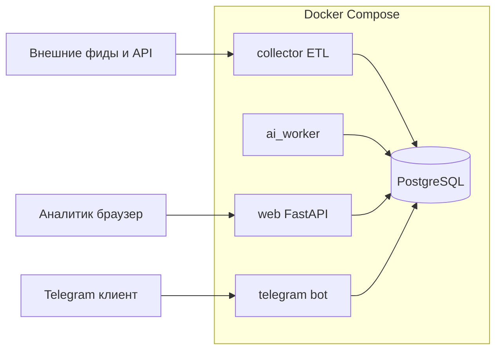
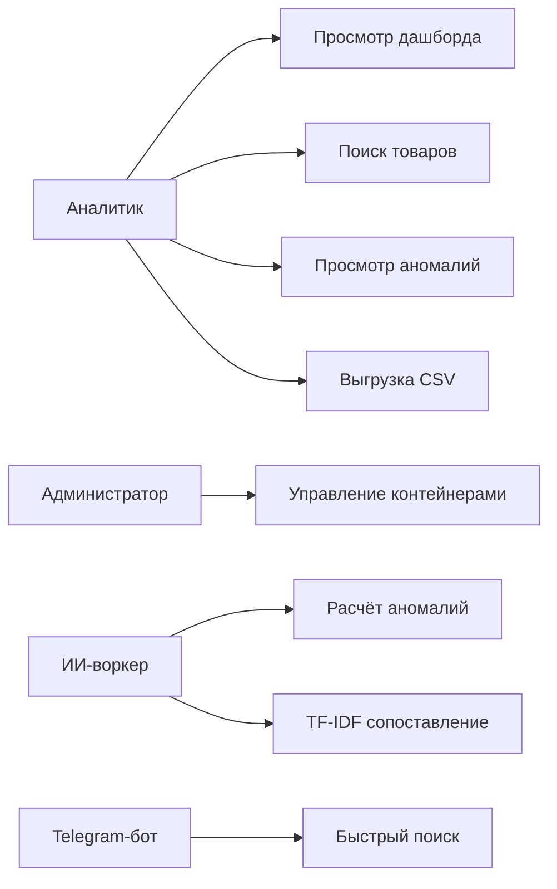
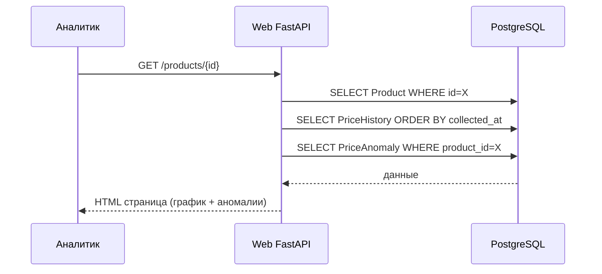
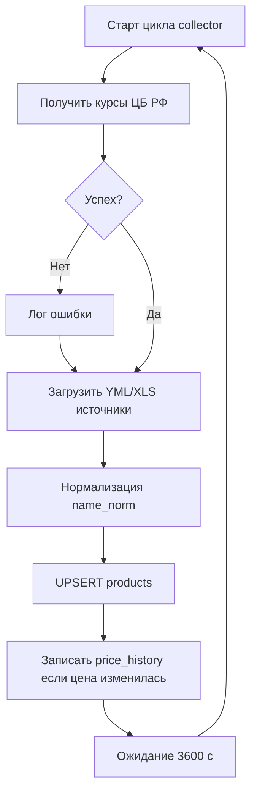
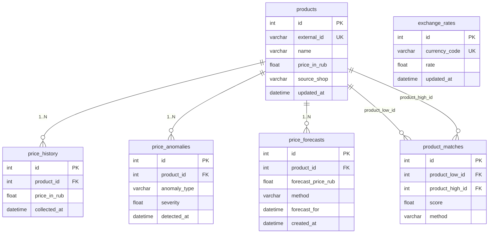
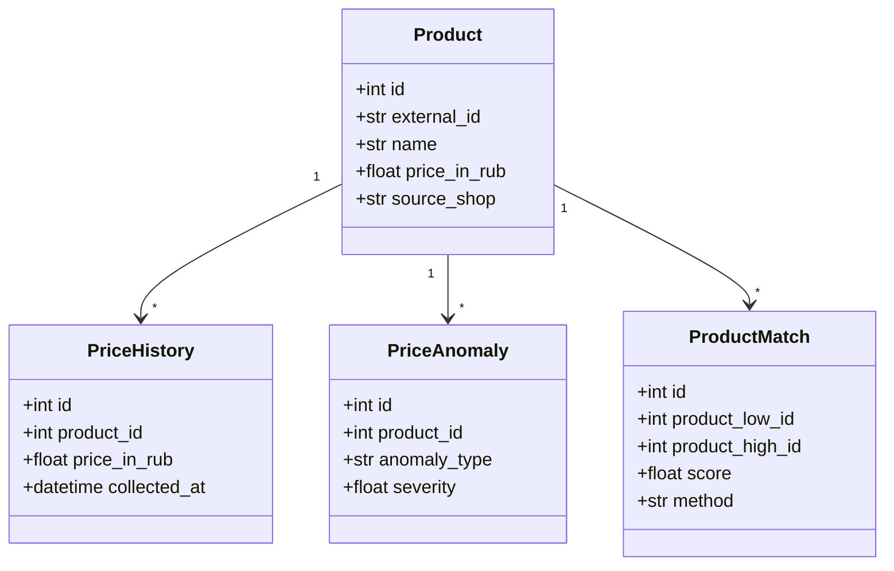
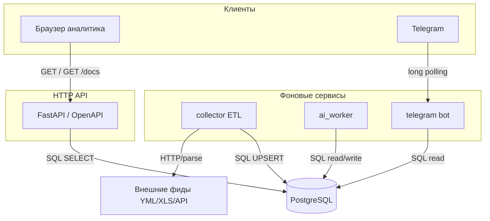

# ВКР и отчёт по практике (главы 1–3)

**Тема:** Разработка микросервисного приложения автоматизированного и визуального анализа данных рынка электронной коммерции.

**Примечание:** Первые две главы могут сдаваться как **отчёт по практике** в том же виде, что и фрагмент ВКР. Третья глава расширяет работу для полной выпускной квалификационной работы.

---

## Введение

Актуальность темы определяется ростом объёмов товарных данных в электронной коммерции: цены и номенклатура поставщиков меняются часто, форматы прайс-листов и каталогов различаются, ручной мониторинг становится дорогим и подверженным ошибкам. Заказчику (розничной торговой организации) требуется единое рабочее место аналитика для визуального анализа динамики цен, выявления аномалий и сопоставления однотипных товаров из разных источников.

**Цель работы:** спроектировать и реализовать микросервисное приложение, включающее контур сбора данных (ETL), веб-интерфейс аналитика, вспомогательный Telegram-интерфейс и программный контур анализа на основе методов машинного обучения и обработки текста.

**Задачи:**

1. Проанализировать деятельность организации практики и сформулировать экономическую постановку задачи.
2. Исследовать существующие решения и обосновать выбор инструментов.
3. Сформировать техническое задание на прототип системы.
4. Спроектировать архитектуру и UML-модели (акцент на поведенческие диаграммы).
5. Реализовать серверный сбор данных, веб-приложение и ИИ-воркер.
6. Провести тестирование и описать результаты.
7. Оценить риски, надёжность и управление проектом; при необходимости выполнить экономическое обоснование.

**Объект:** процессы сбора и анализа товарно-ценовой информации в электронной коммерции.

**Предмет:** программные средства микросервисной архитектуры, веб-визуализации и интеллектуальной обработки ценовых рядов и текстовых наименований товаров.

---

## Глава 1. Аналитическая часть

### 1.1. Анализ организации и постановка проблемы

Организация практики представлена индивидуальным предпринимателем, осуществляющим разработку программного обеспечения на заказ. В рамках практики поступило **техническое задание** от условной торговой компании (или как внутренний продукт для последующих B2B-продаж): обеспечить автоматизированный сбор прайсов и каталогов, нормализацию цен к единой валюте (рубль), визуальный анализ динамики цен и поддержку принятия решений по закупкам и ценообразованию.

**Проблема:** при ручной обработке Excel и разрозненных кабинетах поставщиков аналитик не успевает отслеживать резкие изменения цен, «маркетинговые» скидки после искусственного завышения цены и расхождения в названиях одного и того же SKU у разных магазинов.

**Требуемое решение:** микросервисное приложение с веб-дашбордом, хранилищем истории цен и модулями на основе ML/NLP для аномалий и сопоставления номенклатуры.

### 1.2. Анализ существующих решений

| Подход | Плюсы | Минусы |
|--------|-------|--------|
| Табличные процессоры (Excel, Google Sheets) | Низкий порог входа | Нет масштабируемого ETL, слабая автоматизация, риск ошибок |
| ERP/CRM | Учёт процессов компании | Высокая стоимость, долгая кастомизация под узкую задачу мониторинга внешних цен |
| Специализированные сервисы мониторинга цен | Готовые отчёты | Часто закрытая модель, ограниченная кастомизация под конкретные фиды заказчика |
| BI-системы (Power BI, Metabase и др.) | Сильная визуализация | Требуют отдельного конвейера подготовки данных; не всегда закрывают NLP-сопоставление |

**Вывод:** для учебного и прикладного прототипа целесообразна специализированная система с открытым кодом, Docker-развёртыванием и явным ИИ-контуром.

### 1.3. Анализ и выбор инструментария

- **Python 3.11+** — единый язык для ETL, веб-API и ML.
- **PostgreSQL** — надёжное хранилище с поддержкой UPSERT и аналитических запросов.
- **SQLAlchemy 2.0** — типобезопасная ORM.
- **Docker Compose** — изоляция сервисов: БД, сборщик, веб, бот, ИИ-воркер.
- **FastAPI + Jinja2** — быстрый веб-слой и серверное рендеринг UI без тяжёлого SPA.
- **scikit-learn (TF-IDF)** — объяснимое NLP-сопоставление наименований.
- **Aiogram 3** — мобильный канал уведомлений и быстрого поиска.

### 1.4. Техническое задание (сокращённо)

**Назначение:** автоматизация сбора цен из внешних источников, визуализация и интеллектуальный анализ.

**Функциональные требования:**

1. Периодический сбор данных и обновление таблицы товаров.
2. Запись **истории цен** при изменении цены.
3. Веб-интерфейс: дашборд, поиск, карточка товара с графиком, список аномалий, отчёт по сопоставлениям, выгрузка CSV.
4. ИИ-воркер: обнаружение аномалий в рядах цен; TF-IDF пары между выбранными магазинами; простой прогноз по линейному тренду.
5. Telegram-бот: оперативный поиск и сравнение (вспомогательный канал).

**Нефункциональные требования:** микросервисная изоляция, логирование, переносимость через контейнеры, возможность масштабирования за счёт отдельных реплик воркеров.

---

## Глава 2. Проектирование и разработка

### 2.1. Проектирование системы

#### Диаграмма развёртывания (логическая)

#### Диаграмма вариантов использования (поведенческая)

#### Диаграмма последовательности (сценарий карточки товара с аномалией)

#### Диаграмма деятельности (цикл ETL)

#### ER-диаграмма (основные сущности хранения)

#### Диаграмма классов (ORM-модели)

#### Диаграмма компонентов и API-взаимодействий

Логическое развёртывание (рис. выше) дополняется контрактами между компонентами: веб-сервис обращается к PostgreSQL по **SQL** (чтение/агрегации для HTML и CSV); **collector** выполняет UPSERT товаров и дозапись истории цен; **ai_worker** читает историю и записывает строки в `price_anomalies`, `product_matches`, `price_forecasts`; **telegram-бот** использует те же модели доступа к БД для быстрых запросов. Внешние источники (YML, XLS, HTTP API магазинов) взаимодействуют только с **collector**.

### 2.2. Разработка серверной части и контура сбора данных

Центральным компонентом серверной части системы является модуль сбора и обработки данных — `app/collector.py`. Данный модуль реализует полный цикл ETL (Extract, Transform, Load): извлечение товарных данных из внешних источников, их нормализацию и последующую загрузку в реляционную базу данных PostgreSQL. Запуск модуля осуществляется в виде отдельного Docker-контейнера по расписанию — раз в час — в рамках общей микросервисной конфигурации, описанной в файле `docker-compose.yml` [4].

#### 2.2.1. Получение актуальных курсов валют

Перед загрузкой товарных данных коллектор запрашивает актуальные курсы валют у Центрального банка Российской Федерации через официальный XML-эндпоинт. Полученные значения сохраняются в таблице `exchange_rates`. Все последующие расчёты цен в базе данных производятся в рублях, что обеспечивает единообразие при сравнении товаров из источников с разными валютами. В случае недоступности сервиса ЦБ РФ модуль фиксирует событие в журнале и продолжает работу с ранее сохранёнными курсами, что позволяет избежать остановки всего цикла сбора данных при временных сбоях внешних зависимостей.

#### 2.2.2. Поддерживаемые форматы источников

В рамках реализованного прототипа коллектор поддерживает четыре типа источников данных, различающихся как форматом предоставляемых прайс-листов, так и протоколом доступа.

Первый тип — **YML-каталоги** (Yandex Market Language). Формат YML представляет собой диалект XML, разработанный для обмена товарными данными. Поскольку реальные каталоги поставщиков могут содержать десятки тысяч позиций, для их обработки применяется потоковый разбор на основе `lxml.etree.iterparse`. Данный подход позволяет обрабатывать файлы произвольного объёма без загрузки полного DOM-дерева в оперативную память [12]. После обработки каждого элемента `<offer>` вызывается вспомогательная функция `_clear_parsed_offer`, которая освобождает память через `element.clear()` и удаляет соседние узлы, накопленные парсером. Три поставщика предоставляют данные в формате YML: EKF Group, ТДМ Electric (YML-вариант) и GalaCentre. Для каждого из них реализована отдельная функция извлечения полей (`_ekf_row_from_offer`, `_tbm_row_from_offer`, `_galacentre_row_from_offer`), поскольку схемы атрибутов и правила интерпретации полей у поставщиков различаются.

Второй тип — **XLS-прайс-листы**. Один из поставщиков (ТДМ Electric) также предоставляет данные в формате Microsoft Excel (`.xls`). Для работы с таблицами используется библиотека `xlrd`. Разбор файла включает несколько подготовительных шагов: автоматическое определение строки заголовка (`_tdm_find_header_row`), формирование маппинга столбцов по ключевым словам (`_tdm_map_columns`), эвристическое определение столбца со штрихкодом (`_tdm_guess_barcode_column`). Непосредственная обработка каждой строки данных выполняется функцией `_tdm_try_process_xls_row`, которая фильтрует строки по порогу совпадений (`best_hits >= 50`) и формирует нормализованную запись для последующего сохранения.

Третий тип — **REST API**. Источник FakeStore API служит демонстрационной точкой подключения и обрабатывается через стандартный HTTP-запрос с последующим разбором JSON-ответа. Данный источник предназначен для тестирования конвейера на синтетических данных без зависимости от реальных поставщиков.

Четвёртый тип — **прямые HTTP-ресурсы**. Для источников, предоставляющих данные в виде прямых ссылок на файлы (YML или XLS), применяется загрузка через `requests` с последующей передачей в соответствующий парсер.

#### 2.2.3. Нормализация наименований товаров

Одной из ключевых задач ETL-конвейера является нормализация текстовых наименований товаров. Без приведения к единому виду последующий поиск и сопоставление однотипных позиций из разных источников существенно затруднены: наименования одного и того же товара у разных поставщиков могут содержать различные аббревиатуры, написание латиницей или кириллицей, лишние символы и вариативные разделители.

Для решения этой задачи выделен специализированный пакет `app/matching/text.py`, содержащий публичный API нормализации и сравнения. Функция `normalize_name_for_search` приводит строку к нижнему регистру, удаляет лишние пробелы и спецсимволы, а также выполняет транслитерацию отдельных латинских вставок в кириллицу и наоборот для обеспечения единообразия токенов. Нормализованное значение сохраняется в поле `name_norm` таблицы `products` и используется как в операциях поиска веб-интерфейса, так и при вычислении сходства в ИИ-воркере [8, 9].

Разделение логики нормализации в отдельный пакет обусловлено соображениями архитектурной чистоты: модуль `app/matching/` является единственным источником истины для всех алгоритмов токенизации, транслитерации и вычисления сходства в системе, что исключает дублирование кода между компонентами и упрощает сопровождение при изменении правил нормализации.

#### 2.2.4. Сохранение товаров и ведение истории цен

Запись товарных позиций в базу данных реализована на основе паттерна «вставка или обновление» (upsert). Для каждой записи формируется SQL-выражение `INSERT ... ON CONFLICT (external_id, source_shop) DO UPDATE SET ...` средствами SQLAlchemy Core, что гарантирует идемпотентность операции: повторный запуск коллектора не создаёт дублирующих записей [6, 7].

Функция `_apply_product_upsert` централизует два шага, выполняемых для каждой позиции: непосредственное выполнение upsert-выражения через `session.execute(stmt)` и последующий вызов `record_price_change` из модуля `app/price_history_util.py`. Функция `record_price_change` сравнивает текущую цену товара в базе с новым значением; если цена изменилась, она добавляет новую запись в таблицу `price_history` с меткой времени. Таким образом, таблица `price_history` содержит только реальные изменения цены, а не дублирующие снимки, что оптимизирует объём хранимых данных и упрощает последующий анализ временных рядов.

Схема таблицы `products` включает поля: `id` (суррогатный первичный ключ), `external_id` (идентификатор товара в системе поставщика), `name` (оригинальное наименование), `name_norm` (нормализованное наименование), `price_in_rub` (текущая цена в рублях), `source_shop` (идентификатор источника), `vendor_code` (артикул поставщика), `barcode` (штрихкод при наличии), `updated_at` (метка последнего обновления). Уникальность записи определяется составным ключом `(external_id, source_shop)`.

#### 2.2.5. Обработка ошибок и частичная фиксация данных

При работе с реальными источниками данных неизбежны ситуации, когда отдельные записи содержат некорректные значения — нечисловые цены, пустые обязательные поля или нарушения формата. Для обеспечения устойчивости конвейера применяется стратегия «частичной фиксации»: ошибка при обработке одной записи фиксируется в журнале, но не прерывает загрузку оставшихся позиций из того же источника.

Особого внимания заслуживает обработка потоковых YML-источников. Поскольку итерация по элементам `<offer>` производится в рамках транзакции, блок `finally` гарантирует освобождение памяти даже при возникновении исключения в теле цикла. Для источника GalaCentre предусмотрена дополнительная логика: успешно обработанные записи фиксируются промежуточными `session.flush()` без полного `commit`, что позволяет сохранить частичный результат при обрыве источника на середине файла.

Все ошибки уровня источника (недоступность URL, ошибки HTTP, исключения парсера) логируются с указанием имени источника и типа исключения через стандартный модуль `logging`. Это обеспечивает оперативную диагностику проблем при эксплуатации системы без необходимости подключения к контейнеру.

#### 2.2.6. Взаимодействие с базой данных

Для подключения к PostgreSQL используется движок SQLAlchemy, параметры которого (хост, порт, имя базы, логин и пароль) передаются через переменные окружения, описанные в файле `env.example`. Такой подход соответствует принципу «12-факторного приложения» и обеспечивает переносимость конфигурации между окружениями разработки и развёртывания [4].

Жизненный цикл сессии базы данных в каждом цикле сбора ограничен блоком `with Session(engine) as session`, что гарантирует корректное закрытие соединения вне зависимости от успешности выполнения операций. Финальный `session.commit()` вызывается только после успешного завершения всех upsert-операций для данного источника, что обеспечивает атомарность обновления на уровне одного источника данных.

Схема базы данных управляется средствами Alembic — инструмента миграций для SQLAlchemy. Конфигурация Alembic размещена в файле `alembic.ini`, а сами миграции — в каталоге `alembic/versions/`. Такой подход позволяет воспроизводимо развёртывать и обновлять схему данных в любом окружении командой `alembic upgrade head` без ручного редактирования SQL-скриптов [6].

---

### 2.3. Разработка веб-приложения и клиентских интерфейсов

- **Веб:** `app/web/main.py` — маршруты `/`, `/products`, `/products/{id}`, `/anomalies`, `/matches`, выгрузки `/export/*.csv`, OpenAPI `/docs`.
- **UI:** шаблоны Jinja2 в `app/web/templates/`, графики Chart.js на карточке товара.
- **Telegram:** `app/bot.py` — быстрый поиск и сравнение; не заменяет основное рабочее место аналитика.

### 2.4. Тестирование

**Виды тестирования (теория):** модульное, интеграционное, системное, приёмочное.

**На практике в проекте:**

- Модульные тесты `pytest` для детектора аномалий и TF-IDF (`tests/`).
- Smoke-тест HTTP `/health` без обращения к БД.
- Ручная приёмка: `docker compose up`, проверка веб-интерфейса на порту 8000, логов `collector` и `ai_worker`.

**Контрольный сценарий:** аналитик открывает веб-интерфейс, находит товар, убеждается в наличии графика истории, открывает раздел аномалий и выгружает CSV.

---

## Глава 3. ИИ, оценка качества и управление проектом

### 3.1. Интеграция методов искусственного интеллекта

**Аномалии цен (`app/ml/anomalies.py`, запуск из `app/ai_worker.py`):**

- Класс **spike** — скачок относительно предыдущей точки истории.
- Класс **fake_discount** — рост с последующим заметным снижением (эвристика «лестницы» для скидки).
- Класс **zscore_return** — отклонение доходности последнего шага от распределения предыдущих доходностей.

**NLP / кандидаты сопоставления (`app/ml/tfidf_pairs.py`, `app/ai_worker.py`):** векторизация TF-IDF (включая биграммы) и косинусная близость между наименованиями для пары **EKF ↔ TDM Electric**; отбор пар по порогу `AI_MATCH_MIN_SCORE` (по умолчанию 0,45) и **жадное** неналожение индексов (одна позиция с каждой стороны). В `product_matches` хранятся `match_kind` / `match_status` (кандидат, подтверждён, отклонён); **не** трактуется как гарантированный «единый SKU» без exact-ключей или ревью — формулировки для сдачи: **`docs/PRODUCT_SCOPE.md`**. Дашборд дополняет метрики exact-пересечений ключей и полноты полей (`app/quality/coverage.py`).

**Прогноз:** линейная регрессия по индексу времени для короткого горизонта (метка `linear_trend` в `price_forecasts`). Метод выбран как интерпретируемый baseline; при необходимости его можно заменить на ARIMA/Prophet в перспективе.

### 3.2. Расчёт и управление рисками

| Риск | Вероятность | Влияние | Меры снижения |
|------|-------------|---------|----------------|
| Недоступность внешнего фида | Средняя | Среднее | Повторные попытки, логирование, частичный commit (как в GalaCentre), уведомления |
| Изменение формата YML/XLS | Средняя | Высокое | Версионирование парсеров, мониторинг ошибок collector |
| Ошибочное сопоставление по названию (TF‑IDF) | Средняя | Среднее | Порог `AI_MATCH_MIN_SCORE`, ревью в веб-интерфейсе, опора на exact-пересечения barcode/vendor_code/name_norm |
| Перегрузка БД при больших каталогах | Низкая | Высокое | Лимиты `SHOP_ITEM_LIMIT`, индексы, отдельный воркер |
| Срыв сроков ВКР | Низкая | Высокое | Kanban, недельные итерации, приоритет MVP |

### 3.3. Расчёт надёжности (программные аспекты)

Показатели надёжости на уровне прототипа оцениваются качественно:

- **Изоляция сервисов:** падение `collector` не останавливает веб (данные уже в БД).
- **Идемпотентность загрузки:** UPSERT снижает риск дубликатов.
- **Устойчивость к сбоям сети:** повторные попытки загрузки для отдельных источников.
- При необходимости формализовать **коэффициент готовности** \( K_g = T_0 / (T_0 + T_1) \) для веб-сервиса по логам uptime (заполняется по результатам эксплуатации).

### 3.4. Управление проектом и экономика

**Kanban (пример дорожки апрель–май, иллюстративные даты):**

| Колонка | Содержимое (примеры задач) | Ориентир по времени |
|---------|----------------------------|---------------------|
| Бэклог | Расширение коннекторов, роли в веб, ARIMA вместо линейного тренда | май |
| В работе | Доработка отчёта ВКР, финальные диаграммы, ревью кода | 20–26 апреля |
| Тест | Прогон `pytest`, ручной сценарий `docker compose`, проверка CSV | 24–28 апреля |
| Готово | MVP: ETL + веб + ai_worker + бот, текст глав 1–2 | до 15 апреля |

**Упрощённая таблица-Ганта по неделям (неделя — объём работ):**

| Неделя | Этап / результат |
|--------|-------------------|
| 1–2 | Анализ предметной области, уточнение ТЗ, выбор стека |
| 3–4 | Проектирование схемы БД, прототип collector, деплой PostgreSQL |
| 5–6 | Веб-MVP (дашборд, поиск, карточка товара), выгрузки CSV |
| 7–8 | ИИ-контур: аномалии, TF-IDF, прогноз; интеграционные проверки |
| 9–10 | Тесты, оформление ВКР и отчёта по практике, подготовка к защите |

**Оценка трудозатрат (метод «по аналогии» с разбивкой по этапам):**

| Этап | Часы (оценка) |
|------|----------------|
| Анализ и проектирование | 40 |
| Реализация ETL и БД | 80 |
| Веб-интерфейс и шаблоны | 60 |
| ИИ-воркер и ML-утилиты | 50 |
| Тесты, документация, ВКР | 70 |
| **Итого** \( Q \) | **300** чел·ч |

При ставке разработчика \( S = 1500 \) руб/ч получаем **\( C_{разр} = Q \cdot S = 450\,000 \)** руб. (цифры условные, для защиты подставляются фактические.)

**Эффект для бизнеса (шаблон):**

- Экономия времени аналитика \( \Delta T \) часов/месяц, стоимость часа аналитика \( S_a \) → **\( E_{год} = 12 \cdot \Delta T \cdot S_a \)**.
- **Срок окупаемости** \( T_{ок} = C_{разр} / E_{год} \) при принятых допущениях. Конкретные значения \( \Delta T \), \( S_a \) задаются организацией.

---

## Заключение

В работе спроектировано и реализовано микросервисное приложение для сбора, хранения и визуального анализа цен с отдельным ИИ-воркером. Веб-интерфейс выступает основным рабочим местом аналитика; Telegram-бот обеспечивает мобильный доступ. История цен позволяет строить графики и выявлять аномалии; TF-IDF поддерживает сопоставление номенклатуры между поставщиками. Направления развития: расширение коннекторов, улучшение моделей прогноза, ролевая модель доступа в веб.

---

## Список использованных источников

1. ГОСТ 19.201-78. Единая система программной документации. Техническое задание. Требования к содержанию и оформлению.
2. Таненбаум Э., ван Стен М. Распределённые системы. Принципы и парадигмы.
3. Fowler M., Lewis J. Microservices // ThoughtWorks (материалы по микросервисной архитектуре и границам сервисов).
4. Документация Docker Engine и Docker Compose [Электронный ресурс].
5. Документация FastAPI [Электронный ресурс].
6. Документация SQLAlchemy 2.0 (ORM, Core) [Электронный ресурс].
7. Документация PostgreSQL (SQL, типы данных, агрегаты) [Электронный ресурс].
8. Документация scikit-learn: `TfidfVectorizer`, метрики сходства, линейные модели [Электронный ресурс].
9. Manning C. D., Raghavan P., Schütze H. Introduction to Information Retrieval. — Cambridge University Press, 2008. (разделы по векторному поиску и TF-IDF).
10. Chandola V., Banerjee A., Kumar V. Anomaly detection: A survey // ACM Computing Surveys. — 2009. (обзор методов обнаружения аномалий).
11. Blázquez-García A. et al. A review on outlier/anomaly detection in time series data // arXiv:2002.04236, 2020.
12. Спецификация Yandex Market Language (YML) и практики потокового разбора XML.
13. Документация Aiogram 3 (Telegram Bot API, FSM) [Электронный ресурс].
14. Документация Chart.js [Электронный ресурс] (визуализация временных рядов в веб-интерфейсе).
15. Документация Uvicorn / ASGI [Электронный ресурс] (развёртывание FastAPI).
